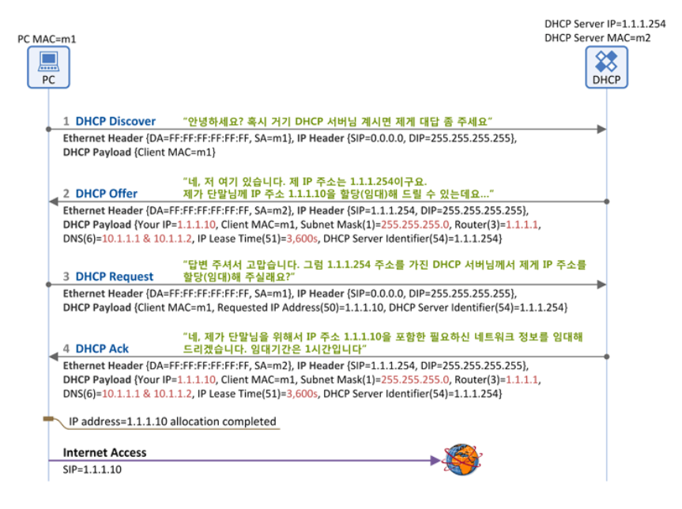

전화를 사용할 때 자신의 전화 번호가 있듯이 인터넷을 사용할 때도 인터넷 주소가 있어야 하는데, 이 인터넷 주소가 IP 주소입니다. 이 인터넷 주소는 통상 인터넷에 접속할 때 동적(Dynamic) 또는 정적(Static)으로 할당 받는데 이 IP 주소를 할당해 주는 프로토콜을 DHCP(Dynamic Host Configuration Protocol)라고 하며 이는 RFC 2131에서 표준 동작을 정의하고 있습니다.

DHCP를 통한 IP 주소 할당은 “임대”라는 개념을 가지고 있는데 이는 DHCP 서버가 IP 주소를 영구적으로 DHCP 클라이언트에 할당하는 것이 아니고 임대기간(IP Lease Time)을 명시하여 그 기간 동안만 DHCP 클라이언트가 IP 주소를 사용하도록 하는 것입니다. DHCP 클라이언트는 임대기간 이후에도 계속 해당 IP 주소를 사용하고자 한다면 IP 주소 임대기간 연장(IP Address Renewal)을 DHCP 서버에 요청해야 하고 또한 DHCP 클라이언트는 임대 받은 IP 주소가 더 이상 필요치 않게 되면 IP 주소 반납 절차(IP Address Release)를 수행하게 됩니다.

DHCP 클라이언트가 DHCP 서버로부터 IP 주소를 할당(임대) 받는 절차에 대해서 알아 보도록 하겠습니다.

IP 주소 할당(임대) 절차에 사용되는 DHCP 메시지는 아래 그림과 같이 4개의 메시지로 구성되어 있습니다.
 

**1) DHCP Discover**

-   메시지 방향: DHCP 클라이언트 -> DHCP 서버
-   브로드캐스트 메시지 (Destination MAC = FF:FF:FF:FF:FF:FF)
-   의미: DHCP 클라이언트가 DHCP 서버를 찾기 위한 메시지입니다. 그래서 LAN상에(동일 subent상에) 브로드캐스팅을 하여 "거기 혹시 DHCP 서버 있으면 내게 응답 좀 해 주세요~"라고 단말이 외칩니다.
-   주요 파라미터
    -   Client MAC: DHCP 클라이언트 의 MAC 주소

**2) DHCP Offer**

-   메시지 방향: DHCP 서버 -> DHCP 클라이언트
-   브로드캐스트 메시지 (Destination MAC = FF:FF:FF:FF:FF:FF)이거나 유니캐스트일수 있습니다. 이는 DHCP 클라이언트가 보낸 DHCP Discover 메시지 내의 Broadcast Flag의 값에 따라 달라지는데, 이 Flag=1이면 DHCP 서버는 DHCP Offer 메시지를 Broadcast로, Flag=0이면 Unicast로 보내게 됩니다.
-   의미: DHCP 서버가 "저 여기 있어요~"라고 응답하는 메시지입니다. 단순히 DHCP 서버의 존재만을 알리지 않고, DHCP 클라이언트에 할당할 IP 주소 정보를 포함한 다양한 "네트워크 정보"를 함께 실어서 단말에 전달합니다.
-   주요 파라미터
    -   Client MAC: DHCP 클라이언트의 MAC 주소
    -   Your IP: DHCP 클라이언트에 할당(임대)할 IP 주소
    -   Subnet Mask (Option 1)
    -   Router (Option 3): DHCP 클라이언트의 Default Gateway IP 주소
    -   DNS (Option 6): DNS 서버 IP 주소
    -   IP Lease Time (Option 51): DHCP 클라이언트가 IP 주소(Your IP)를 사용(임대)할 수 있는 기간(시간)
    -   DHCP Server Identifier (Option 54): 본 메시지(DHCP Offer)를 보낸 DHCP 서버의 주소. 2개 이상의 DHCP 서버가 DHCP Offer를 보낼 수 있으므로 각 DHCP 서버는 자신의 IP 주소를 본 필드에 넣어서 단말에 보냄

**3) DHCP Request**

-   메시지 방향: DHCP 클라이언트 -> DHCP 서버
-   브로드캐스트 메시지 (Destination MAC = FF:FF:FF:FF:FF:FF)
-   의미: DHCP 클라이언트는 DHCP 서버(들)의 존재를 알았고, DHCP 서버가 DHCP 클라이언트에 제공할 네트워크 정보(IP 주소, subnet mask, default gateway등)를 알았습니다. 이제 DHCP 클라이언트는 DHCP Request 메시지를 통해 하나의 DHCP 서버를 선택하고 해당 서버에게 " DHCP 클라이언트가 사용할 네트워크 정보"를 요청합니다.
-   주요 파라미터
    -   Client MAC: DHCP 클라이언트의 MAC 주소
    -   Requested IP Address (Option 50): 난 이 IP 주소를 사용하겠다. (DHCP Offer의 Your IP 주소가 여기에 들어감)
    -   DHCP Server Identifier (Option 54): 2대 이상의 DHCP 서버가 DHCP Offer를 보낸 경우, DHCP 클라이언트는 이 중에 마음에 드는 DHCP 서버 하나를 고르게 되고,  그 서버의 IP 주소가 여기에 들어감. 즉, DHCP Server Identifier에 명시된 DHCP 서버에게 "DHCP Request" 메시지를 보내어 DHCP 클라이언트 IP 주소를 포함한 네트워크 정보를 얻는 것임

**4) DHCP Ack**

-   메시지 방향: DHCP 서버 -> DHCP 클라이언트
-   브로드캐스트 메시지 (Destination MAC = FF:FF:FF:FF:FF:FF) 혹은 유니캐스트일수 있으며 이는 DHCP 클라이언트가 보낸 DHCP Request 메시지 내의 Broadcast Flag=1이면 DHCP 서버는 DHCP Ack 메시지를 Broadcast로, Flag=0이면 Unicast로 보내게 됩니다.
-   의미: DHCP 절차의 마지막 메시지로, DHCP 서버가 DHCP 클라이언트에게 "네트워크 정보"를 전달해 주는 메시지입니다. 앞서 설명드린 DHCP Offer의 '네트워크 정보"와 동일한 파라미터가 포함됩니다.
-   주요 파라미터
    -   Client MAC: DHCP 클라이언트의 MAC 주소
    -   Your IP: DHCP 클라이언트에 할당(임대)할 IP 주소
    -   Subnet Mask (Option 1)
    -   Router (Option 3): DHCP 클라이언트의 Default Gateway IP 주소
    -   DNS (Option 6): DNS 서버 IP 주소
    -   IP Lease Time (Option 51): DHCP 클라이언트가 본 IP 주소(Your IP)를 사용(임대)할 수 있는 기간(시간)
    -   DHCP Server Identifier (Option 54): 본 메시지(DHCP Ack)를 보낸 DHCP 서버의 주소

이렇게 DHCP Ack를 수신한 DHCP 클라이언트는 이제 IP 주소를 포함한 네트워크 정보를 획득(임대)하였고, 이제 인터넷 사용이 가능하게 됩니다.
