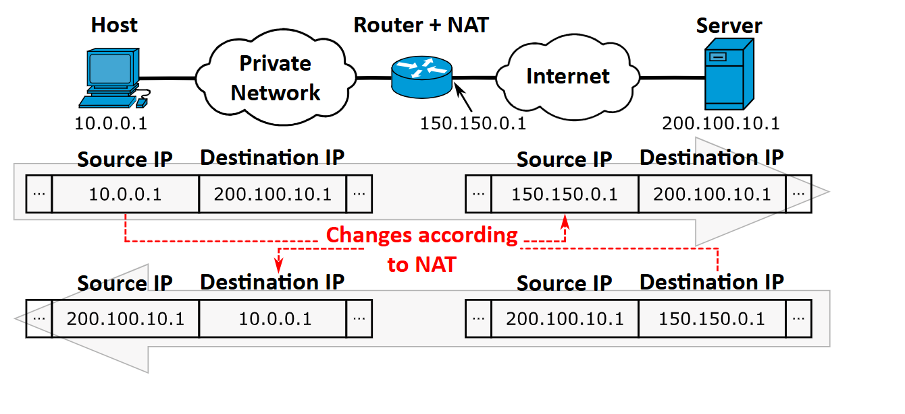

# 🔁 NAT 완전 정복: IP 주소 고갈을 막고 내부 네트워크를 보호하는 핵심 기술

> 사설 IP로 인터넷에 접속할 수 있는 비밀은?
> NAT의 원리부터 SNAT/DNAT, PAT, 실무 구성과 보안까지 완벽 해설!

---

## 📌 1. NAT란?

\*\*NAT(Network Address Translation)\*\*은 내부 네트워크의 **사설 IP 주소**를 **공인 IP 주소로 변환**하여 인터넷 통신이 가능하도록 만드는 기술입니다.

> 즉, NAT는 IP 패킷의 \*\*IP 주소(및 포트)\*\*를 중간 장비(보통 공유기 또는 라우터)에서 **실시간으로 변환**해주는 역할을 합니다.
<br>

---

## 🌐 2. 왜 NAT가 필요한가?

### 🧠 문제: IPv4 주소 고갈

* IPv4는 **32비트** → 약 **43억 개 주소**
* 인터넷 사용자, IoT 장치 급증 → **공인 IP 부족**

### 🛠️ 해결: 사설 IP + NAT

| 개념        | 설명                             |
| --------- | ------------------------------ |
| **사설 IP** | 내부에서만 통용되는 비공개 IP 주소           |
| **공인 IP** | 전 세계에서 유일한 주소, 인터넷 통신에 사용      |
| **NAT**   | 사설 ↔ 공인 주소를 변환하여 외부와 통신 가능하게 함 |

---

## 🧱 3. NAT 동작 원리

### 🔄 기본 흐름

```text
내부 PC (192.168.0.2)
   ↓
[라우터: NAT 수행]
   ↓
공인 IP (203.0.113.1)
   ↓ 인터넷
```

* **출발지 IP 변경**: 내부 → 외부
* **도착지 IP 변경**: 외부 → 내부 (응답 패킷 시)

> NAT 장비는 \*\*"연결 테이블"\*\*을 유지하여 어떤 내부 IP와 포트가 어떤 외부 IP/포트로 매핑되었는지 관리함.

---

## 🔍 4. NAT의 유형

### ✅ 4.1 Static NAT (정적 NAT)

* **내부 IP ↔ 공인 IP** 1:1 고정 매핑
* 내부 서버를 외부에 고정 주소로 노출

| 내부 IP        | 공인 IP        |
| ------------ | ------------ |
| 192.168.0.10 | 203.0.113.10 |

> 사용 예: 사내 웹서버, 메일서버 외부 공개

---

### 🔁 4.2 Dynamic NAT (동적 NAT)

* 사설 IP ↔ 공인 IP \*\*풀(pool)\*\*을 기반으로 **필요할 때 할당**
* 공인 IP 수가 제한적일 때 사용

> 📌 단점: 동시에 접속하는 장치 수가 공인 IP 수보다 많으면 **접속 불가**

---

### 🔀 4.3 PAT (Port Address Translation) 또는 NAT Overload

* 하나의 공인 IP에 **포트 번호까지 추가로 매핑** → 수천 대 장치 인터넷 사용 가능

```text
192.168.0.2:45678 → 203.0.113.1:10001
192.168.0.3:45679 → 203.0.113.1:10002
```

| 내부 IP:포트          | 공인 IP:포트          |
| ----------------- | ----------------- |
| 192.168.0.2:45678 | 203.0.113.1:10234 |
| 192.168.0.3:45679 | 203.0.113.1:10235 |

> 가장 **보편적으로 사용되는 NAT 방식** (가정용 공유기, 회사 NAT 라우터 등)

---

### ↔️ 4.4 SNAT vs DNAT

| 구분    | SNAT (Source NAT) | DNAT (Destination NAT) |
| ----- | ----------------- | ---------------------- |
| 목적    | **출발지 IP 변환**     | **도착지 IP 변환**          |
| 예시    | 내부 사용자가 인터넷 접속    | 외부 사용자가 내부 서버에 접속      |
| 사용 위치 | 내부 → 외부           | 외부 → 내부                |

---

## 🔐 5. NAT와 보안

### ✔️ 장점

| 항목       | 설명                               |
| -------- | -------------------------------- |
| IP 주소 절약 | 수천 대의 장치를 하나의 공인 IP로 인터넷 연결 가능   |
| 내부 보호    | 외부에서 사설 IP 직접 접근 불가 (일종의 방화벽 효과) |
| 간접 연결    | 클라이언트/서버 모델에서 유연한 설정 가능          |

### ⚠️ 단점

| 항목        | 설명                            |
| --------- | ----------------------------- |
| 서버 호스팅 불편 | 외부에서 내부로 직접 접속 어려움 (포트포워딩 필요) |
| P2P 통신 제한 | 연결 주도권이 외부에서 내부로 갈 수 없음       |
| 성능 오버헤드   | 포트 매핑 테이블 유지/변환 비용 존재         |
| 보안 착각     | NAT은 보안 기능이 아님. **추가 방화벽 필요** |

---

## 🛠️ 6. 실무 구성 예제

### 📦 포트 포워딩 (DNAT)

* 내부 웹서버(192.168.0.100:80)를 공인 IP 203.0.113.1의 포트 8080으로 연결

```bash
# 리눅스 iptables 예시
iptables -t nat -A PREROUTING -p tcp --dport 8080 \
  -j DNAT --to-destination 192.168.0.100:80
```

---

## 🔎 7. NAT 동작 예시 (PAT 기준)

```text
내부:
PC1 → 192.168.0.2:45678 → NAT → 203.0.113.1:10001
PC2 → 192.168.0.3:45679 → NAT → 203.0.113.1:10002

인터넷 응답 수신:
203.0.113.1:10001 → NAT 테이블 조회 → 192.168.0.2:45678
```

---

## 🧠 8. NAT과 관련된 주요 개념

| 용어                | 설명                                       |
| ----------------- | ---------------------------------------- |
| **NAT Table**     | 내부 ↔ 외부 IP/포트 매핑 정보 테이블                  |
| **Timeout**       | 일정 시간 이상 응답 없으면 매핑 삭제                    |
| **Hairpin NAT**   | 동일 NAT 내부에서 공인 IP로 접속 가능하게 허용            |
| **NAT Traversal** | P2P 연결을 위한 NAT 우회 기술 (STUN, TURN, ICE 등) |

---

## 📚 참고 자료

* [RFC 3022 - Traditional NAT](https://datatracker.ietf.org/doc/html/rfc3022)
* [Cisco NAT Configuration Guide](https://www.cisco.com/c/en/us/td/docs/ios-xml/ios/ipaddr_nat/configuration)
* Wireshark를 통한 NAT 패킷 분석 예제

---

## ✅ 요약 정리

| 항목    | 설명                                          |
| ----- | ------------------------------------------- |
| 목적    | 사설 IP 주소를 공인 IP로 변환                         |
| 핵심 역할 | 주소 절약, 내부 네트워크 보호                           |
| 주요 방식 | Static NAT, Dynamic NAT, PAT (NAT Overload) |
| 확장 개념 | SNAT, DNAT, Port Forwarding, NAT Traversal  |
| 실무 구성 | 홈 공유기, 기업 라우터, 클라우드 네트워크 구성 필수 기술           |

