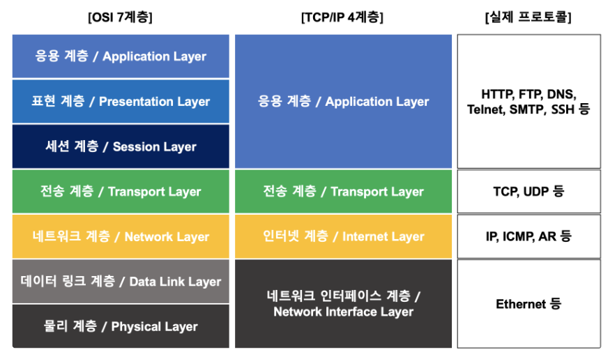

# 🌐 OSI 7 Layer vs TCP/IP 4 Layer 완전 정복

> 네트워크 개발자와 보안 엔지니어를 꿈꾸는 사람이라면 반드시 이해해야 할 **네트워크 계층 모델**의 모든 것.
 

---

## 🧭 1. 왜 계층(Layer) 모델이 필요한가?

컴퓨터 네트워크는 **복잡한 통신 작업을 추상화하고 모듈화**하여 처리하기 위해 계층화된 구조를 사용합니다. 이 계층화된 모델은 다음과 같은 장점을 제공합니다:

* **표준화**: 서로 다른 벤더의 시스템 간 상호 운용 가능
* **디버깅 용이**: 특정 계층에서 문제 추적 가능
* **유지보수 효율화**: 한 계층만 수정해도 전체 시스템에 영향 최소화
* **기능 분리**: 각 계층이 독립적인 책임을 가짐

---

## 🏗️ 2. OSI 7계층 모델

**OSI (Open Systems Interconnection) 모델**은 ISO(국제표준화기구)에서 제안한 네트워크 통신 표준 모델입니다.

### 📚 OSI 7계층 요약

| 계층 | 이름           | 주요 기능                     | 예시                     |
| -- | ------------ | ------------------------- | ---------------------- |
| 7  | Application  | 사용자와 직접 상호작용, 서비스 제공      | HTTP, FTP, SMTP        |
| 6  | Presentation | 데이터 표현 형식 변환, 암호화/복호화     | JPEG, MPEG, SSL, ASCII |
| 5  | Session      | 세션 설정, 유지, 종료             | RPC, NetBIOS           |
| 4  | Transport    | 신뢰성 있는 전송, 흐름 제어, 오류 복구   | TCP, UDP               |
| 3  | Network      | 논리적 주소(IP), 경로 설정 (라우팅)   | IP, ICMP, IGMP         |
| 2  | Data Link    | 프레임 생성, 물리 주소(MAC), 오류 검출 | Ethernet, PPP, Switch  |
| 1  | Physical     | 비트 전송, 물리 매체 연결           | 케이블, 허브, 리피터           |

---

### 🎯 OSI 각 계층 핵심 요약

* **물리 계층 (1계층)**: 실제 비트를 전송하는 하드웨어적 통신 (ex: 전기 신호, 광 신호)
* **데이터 링크 계층 (2계층)**: 프레임 단위로 데이터를 전송하며 MAC 주소를 기반으로 통신
* **네트워크 계층 (3계층)**: IP 주소 기반으로 패킷을 목적지까지 전달
* **전송 계층 (4계층)**: TCP/UDP를 통해 종단 간 신뢰성 있는 데이터 전송
* **세션 계층 (5계층)**: 애플리케이션 간 대화(세션)를 설정하고 관리
* **표현 계층 (6계층)**: 데이터 인코딩, 암호화, 압축 등 수행
* **응용 계층 (7계층)**: 사용자에게 직접 네트워크 서비스를 제공

---

## 🚀 3. TCP/IP 4계층 모델

**TCP/IP 모델**은 실질적으로 인터넷을 구성하는 표준 프로토콜 집합으로, OSI보다 **현실적인 모델**입니다.

### 📚 TCP/IP 4계층 요약

| 계층 | 이름             | 주요 프로토콜 및 기능                | OSI 대응 계층         |
| -- | -------------- | --------------------------- | ----------------- |
| 4  | Application    | 애플리케이션 서비스 제공 (HTTP, DNS 등) | OSI 5, 6, 7 계층 통합 |
| 3  | Transport      | 종단 간 통신 제어 (TCP, UDP)       | OSI 4계층           |
| 2  | Internet       | 라우팅 및 IP 주소 지정 (IP, ICMP)   | OSI 3계층           |
| 1  | Network Access | 물리적 전송 + 링크 계층 (Ethernet 등) | OSI 1, 2계층 통합     |

---

### 🎯 TCP/IP 모델 특징

* **실제 네트워크 구현에 기반**하여 만들어졌기 때문에 **현실에서 가장 많이 사용**
* OSI보다 간단하며 **4계층 구조**
* 인터넷 통신의 표준 프로토콜 스택

---

## 🔍 4. OSI 7계층 vs TCP/IP 4계층 비교

| 구분    | OSI 7계층        | TCP/IP 4계층            |
| ----- | -------------- | --------------------- |
| 목적    | 표준화된 이론적 모델    | 실용적인 인터넷 프로토콜 모델      |
| 계층 수  | 7계층            | 4계층                   |
| 정의 주체 | ISO            | DARPA/DoD             |
| 사용 범위 | 교육, 이론 중심      | 실제 구현 중심 (인터넷 통신 기반)  |
| 세부 기능 | 계층 간 기능 분리가 명확 | 일부 계층이 통합됨 (예: 응용 계층) |

---

## 🧪 5. 실제 예제: 웹 브라우저에서 웹 페이지 요청 흐름

### 사용자가 `http://example.com`을 입력했을 때

1. **Application 계층 (7, 6, 5 / TCP 4계층)**

   * HTTP 요청 생성
   * DNS 조회 수행

2. **Transport 계층 (OSI 4 / TCP 3계층)**

   * TCP 3-way handshake
   * 포트 기반 통신

3. **Network 계층 (OSI 3 / TCP 2계층)**

   * IP 주소 기반 패킷 전송
   * 라우팅 경로 결정

4. **Data Link + Physical 계층 (OSI 2\~1 / TCP 1계층)**

   * MAC 주소 기반 이더넷 프레임 전송
   * 실제 전기적 신호로 전송

---

## 🧠 6. 마무리 정리

| OSI 7 Layer      | TCP/IP 4 Layer |
| ---------------- | -------------- |
| Application (7)  |                |
| Presentation (6) |                |
| Session (5)      | Application    |
| Transport (4)    | Transport      |
| Network (3)      | Internet       |
| Data Link (2)    |                |
| Physical (1)     | Network Access |

> 🔍 **포인트**: OSI는 교육용으로 유용하고, TCP/IP는 실전용으로 사용됩니다.

---

## 📌 결론

OSI 7계층과 TCP/IP 4계층은 **서로 다른 관점의 네트워크 설계 철학**입니다. OSI는 개념 정리에 적합하고, TCP/IP는 실제 구현에서 널리 활용됩니다. 이 두 모델을 함께 이해하면 네트워크 구조를 깊이 있게 파악할 수 있습니다.

---

## 🔧 참고 자료

* [RFC 1122, 1123 - TCP/IP Internals](https://tools.ietf.org)
* [ISO/IEC 7498-1:1994 - OSI Reference Model](https://www.iso.org/standard/20269.html)

